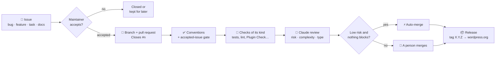
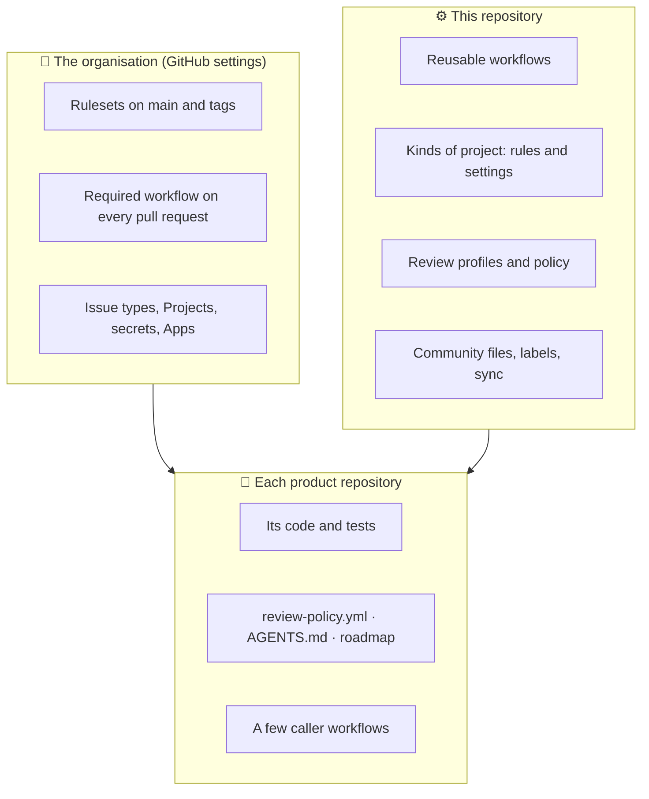

<picture>
  <source media="(prefers-color-scheme: dark)" srcset="profile/diluxone-isologo-horizontal-fondo-oscuro.svg">
  
</picture>

# DiluxOne/.github

**How every DiluxOne repository is checked, reviewed, merged and released, written once, here.**

Each repository calls the workflows in this one instead of carrying its own copy, and inherits its community files (contributing guide, security policy, issue forms, pull request template). Change a rule here and every repository follows it.

| 🎫 No issue, no code | 🔍 Checked and reviewed | 🚦 Nothing merges red |
| --- | --- | --- |
| Every pull request closes an issue a maintainer accepted. A paid or already planned feature is stopped there, before anyone writes it. | Deterministic checks for the kind of project, then a Claude review that labels risk and complexity and comments on what blocks. | Rulesets require every check. Only a low-risk, low-complexity change from a trusted author merges on its own; anything else waits for a person. |

## The life of a change

Step by step, with every detail: [What happens on a pull request](docs/pull-requests.md).

## Who holds what

## The rules in one minute

- **Conventional Commits** for branches, titles and commits. CI rejects anything else.
- **One accepted issue per pull request.** Bots' pull requests (Dependabot, releases) are the exception.
- **Policy is data.** Risk paths, models, budget and auto-merge live in [`policy/`](policy/) and in each repository's `.github/review-policy.yml`, read from the base branch, so a pull request cannot loosen its own rules.
- **A review lesson becomes a rule.** Something a reviewer sent back once becomes one entry in its kind's `rules.yml`, with fixtures, never a new script ([`kinds/`](kinds/)).
- **Secrets never meet a fork's code.** Actions are pinned to a commit and every token asks for the least it needs.
- **Versions are tags.** Repositories call `@v5`. A breaking change ships as `v6`, and older majors stay where they are.

## What's inside

| | Folder | What it holds |
| --- | --- | --- |
| ⚙️ | [`.github/workflows/`](.github/workflows/) | The reusable workflows and the organisation's required pull request pipeline |
| 🧩 | [`kinds/`](kinds/) | One pack per kind of project (today, `wordpress-plugin`): its rules, review profile and settings |
| 📜 | [`policy/`](policy/) | The default review policy every repository adds to |
| 🤖 | [`review-profiles/`](review-profiles/) | What the Claude review looks for |
| 🛠️ | [`scripts/`](scripts/) | The logic behind the workflows, each script with its own `--test` |
| 📋 | [`workflow-templates/`](workflow-templates/) | Ready-made callers for a new repository |
| 🏷️ | [`labels.yml`](labels.yml) · [`repos.yml`](repos.yml) | Labels, settings and Projects, kept in step by `scripts/sync-repos.py` |
| 🖼️ | [`profile/`](profile/) | The organisation's public page on GitHub |

## Read more

| If you want to… | Read |
| --- | --- |
| Contribute to any DiluxOne repository | [CONTRIBUTING.md](CONTRIBUTING.md) |
| Point an AI agent at a repository | [docs/agents.md](docs/agents.md) |
| Follow a pull request through every step | [docs/pull-requests.md](docs/pull-requests.md) |
| Bring a new repository in | [docs/adopting.md](docs/adopting.md) |
| Move a repository to a newer major | [docs/migrating.md](docs/migrating.md) |
| Look up a workflow, a script, a secret | [docs/workflows.md](docs/workflows.md) |
| Add a rule or a kind of project | [kinds/README.md](kinds/README.md) |
| Change this repository and ship it | [docs/maintaining.md](docs/maintaining.md) |
| Report a security problem | [SECURITY.md](SECURITY.md) |
