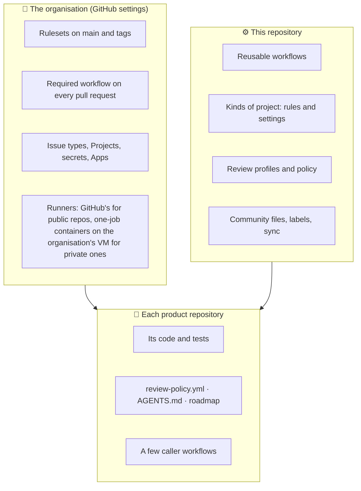

<picture>
  <source media="(prefers-color-scheme: dark)" srcset="profile/diluxone-isologo-horizontal-fondo-oscuro.svg">
  
</picture>

# DiluxOne/.github

**How every DiluxOne repository is checked, reviewed, merged and released, written once, here.**

Each repository calls the workflows in this one instead of carrying its own copy, and inherits its community files (contributing guide, security policy, issue forms, pull request template). Change a rule here and every repository follows it.

| 🎫 No issue, no code | 🔍 Checked and reviewed | 🚦 Nothing merges red |
| --- | --- | --- |
| Every pull request closes an issue a maintainer accepted. A paid or already planned feature is stopped there, before anyone writes it. | Deterministic checks for the kind of project, then a Claude review that labels risk and complexity and comments on what blocks. | Rulesets require every check. A change merges on its own only when it touches low-risk paths alone, the review rates it low risk and low complexity, nothing blocks, its author is trusted and every check is green. Anything else waits for a person, and every release waits for a person's approval. |

## The life of a change

```mermaid
flowchart LR
    A["📝 Issue<br/>a PRD: problem, scope, criteria"] --> B{"Maintainer<br/>accepts?<br/>(PRD sealed)"}
    B -- "no" --> X["Closed or<br/>kept for later"]
    B -- "accepted" --> S["🤖 Autopilot writes the Spec<br/>on the issue (sealed)"]
    P["🐞 Bug report"] --> Q{"Reproduced by<br/>a failing test?"}
    Q -- "no: what was tried,<br/>what is missing" --> X
    Q -- "yes" --> V["Fix issue opened by the bot<br/>accepted by policy (PRD sealed)<br/>the test is the spec"]
    V --> S
    S --> C["📋 Draft pull request, in the open<br/>a box per criterion<br/>one commit each, ticked as it lands"]
    C -- "out of turns or time" --> K["🔁 autopilot:continue<br/>resumes the draft,<br/>or starts it"]
    K --> C
    C -- "stuck: says why" --> I
    C -- "every box ticked<br/>checks pass" --> D["✅ Ready for review<br/>conventions + accepted-issue gate<br/>checks of its kind"]
    D --> F["🤖 Claude review<br/>risk · complexity · type"]
    F -- "blocks (5 rounds)" --> C
    F --> L["Merges on its own when<br/>not Critical · no protected path,<br/>but a reproduced bug's fix that widens nothing<br/>review clean · within the lane<br/>a test per criterion · every check green"]
    L --> G{"All of them?"}
    G -- "yes" --> H["⚡ Auto-merge<br/>+ receipt"]
    G -- "any no" --> I["👤 A person merges"]
    H --> W["Waits on main,<br/>nothing published"]
    I --> W
    W --> R{"🔐 Release X.Y.Z issue<br/>accepted by a person?"}
    R -- "accepted" --> P["📋 Release pull request<br/>Unreleased. removed, version set"]
    P -- "merged" --> V{"Accepted by a person<br/>and the same version?"}
    V -- "yes" --> J["📦 Tag X.Y.Z<br/>→ production, published"]
    V -- "no" --> W
```

Publishing is the third decision a person makes, after accepting the issue and, sometimes, merging: an issue "Release X.Y.Z" (the Release form), whose acceptance opens the release pull request; once it merges, the release workflow checks that a person with the admin or maintain role accepted that issue for that version before anything is published. The bot opens one only when a person closes the version's milestone (`X.Y.Z`), and a person still accepts it.

You can follow an autopilot run as it goes: its draft pull request is the Spec as a checklist, one box per criterion, ticked as each criterion's commit lands; the issue's board links the pull request, the run and the progress; the run's summary says what the agent read, ran and changed, and keeps its full transcript. A run never ends in silence: the pull request is ready for review, or the agent says where it stopped and why, or the run continues (`autopilot:continue`), or the workflow says so and hands it to a person (`needs-human`). A pull request that is not the autopilot's, a person's or a contributor's, joins the same path at "Ready for review".

A person who wants to write the code of an accepted issue themselves claims it (`/claim`, or the checkbox in its form, #488): the autopilot steps aside for them, the first one wins, and a claim that stalls is released after 10 days and handed back to the autopilot, so no issue waits on nobody ([CONTRIBUTING.md](CONTRIBUTING.md), "Start from an issue").

A bug report needs no person to start its fix once it is reproduced: the reproduction writes a unit test from the report, runs it where it can reach nothing, and when it fails, the bot opens an issue of its own for the fix, accepted by the `bugfix-reproduced` lane of the autonomy policy; the autopilot then has to make that exact test pass, through every gate. A report that does not reproduce gets what was tried and what would settle it; one that is really a feature request becomes a Feature and waits for a maintainer, like any request.

Step by step, with every detail: [What happens on a pull request](docs/pull-requests.md).

## Who holds what

```mermaid
flowchart TB
    subgraph ORG["🏢 The organisation (GitHub settings)"]
        O1["Rulesets on main and tags"]
        O2["Required workflow on every pull request"]
        O3["Issue types, Projects, secrets, Apps"]
        O4["Runners: GitHub's for public repos, one-job containers on the organisation's VM for private ones"]
    end
    subgraph HUB["⚙️ This repository"]
        H1["Reusable workflows"]
        H2["Kinds of project: rules and settings"]
        H3["Review profiles and policy"]
        H4["Community files, labels, sync"]
    end
    subgraph REPO["🧩 Each product repository"]
        R1["Its code and tests"]
        R2["review-policy.yml · AGENTS.md · roadmap"]
        R3["A few caller workflows"]
    end
    ORG --> REPO
    HUB --> REPO
```

## The rules in one minute

- **Conventional Commits** for branches, titles and commits. CI rejects anything else.
- **One accepted issue per pull request.** Bots' pull requests (Dependabot, releases) are the exception.
- **An accepted issue names who works it.** Whoever accepts it becomes its assignee, if it has none, until a member of the organisation opens the pull request that closes it; a bot never is, so a lane's issue stays unassigned.
- **Autonomy is data too, and never past its ceiling.** What may proceed without a person comes from [`policy/autonomy.yml`](policy/autonomy.yml): named lanes, each checked against GitHub, never against an issue's text. A repository can tighten it, or raise what a lane merges up to the ceiling the organisation sets for it; the rules that govern it always need a person, and `DX_AUTOPILOT=off` stops it all.
- **A merge that turns main red is reverted.** Not when the red is a flaky job (it runs again once first); the revert closes a Bug issue that links the merge, the run and the pull request, and merges on its own only within the `platform` lane ([docs](docs/pull-requests.md)).
- **Policy is data.** Risk paths, models, budget and auto-merge live in [`policy/`](policy/) and in each repository's `.github/review-policy.yml`, read from the base branch, so a pull request cannot loosen its own rules.
- **A review lesson becomes a rule.** Something a reviewer sent back once becomes one entry in its kind's `rules.yml`, with fixtures, never a new script ([`kinds/`](kinds/)).
- **Secrets never meet a fork's code.** Actions are pinned to a commit and every token asks for the least it needs.
- **Every job starts clean.** Public repositories run on GitHub's runners; private ones on the organisation's VM, each job in a disposable container of an image rebuilt and smoke-tested every day ([`runner/`](runner/)).
- **What waits is listed, every day.** One pinned issue here lists each open pull request older than a day, what blocks it and on whom it waits; another, every week, the lead time, the merge queue's failures, the autopilot's runs and the flaky tests found ([docs](docs/workflows.md)).
- **Every pending step names its action and its URL.** Agents tell a maintainer exactly what to accept, approve or merge, with the link; an outside contributor is never asked for a maintainer's step.
- **Versions are tags.** Repositories call `@v7`. A breaking change ships as `v8`, and older majors stay where they are.

## What's inside

| | Folder | What it holds |
| --- | --- | --- |
| ⚙️ | [`.github/workflows/`](.github/workflows/) | The reusable workflows and the organisation's required pull request pipeline |
| 🧩 | [`kinds/`](kinds/) | One pack per kind of project (today, `wordpress-plugin`, and `ai-agent-plugin`, a plugin for coding agents published in the `diluxone-plugins-ai` catalog): its rules, review profile and settings |
| 📜 | [`policy/`](policy/) | The default review policy every repository adds to, and what every kind shares: the autonomy policy, the issue schema, the stacks a way to reproduce a bug is proposed from (`repro-stacks.yml`) |
| 🤖 | [`review-profiles/`](review-profiles/) | What the Claude review looks for |
| 🛠️ | [`scripts/`](scripts/) | The logic behind the workflows, each script with its own `--test`; [`scripts/runner-vm/`](scripts/runner-vm/) keeps the organisation's VM in its described state |
| 🧪 | [`tests/`](tests/) | pytest tests: the reproduction's examples (`tests/examples/`), the bugs it reproduced, kept (`tests/repro/`), and the workflows' wiring (`tests/workflows/`) |
| 🏃 | [`runner/`](runner/) | The image every job on the organisation's VM runs in, `ghcr.io/diluxone/runner` |
| 📋 | [`workflow-templates/`](workflow-templates/) | Ready-made callers for a new repository |
| 🎨 | [`design-systems/`](design-systems/) | What a screen looks like: tokens, components and the rules a review checks (today, `wordpress-admin`); each project names its own in `repos.yml` |
| 🏷️ | [`labels.yml`](labels.yml) · [`repos.yml`](repos.yml) | Labels, settings, and one entry per repository (#562): its kind, Project, design system, the way it reproduces a bug when its pack and its policy declare none (`repro:`), its callers' values and what it adds to its Dependabot template (`kinds/<kind>/dependabot.yml`, `policy/dependabot.default.yml`), kept in step by `scripts/sync-repos.py` |
| 🖼️ | [`profile/`](profile/) | The organisation's public page on GitHub |

## Read more

| If you want to… | Read |
| --- | --- |
| Contribute to any DiluxOne repository | [CONTRIBUTING.md](CONTRIBUTING.md) |
| Point an AI agent at a repository | [docs/agents.md](docs/agents.md) |
| Follow a pull request through every step | [docs/pull-requests.md](docs/pull-requests.md) |
| Bring a new repository in | [docs/adopting.md](docs/adopting.md) |
| Run the engine in another organisation | [docs/installing.md](docs/installing.md) |
| Move a repository to a newer major | [docs/migrating.md](docs/migrating.md) |
| Look up a workflow, a script, a secret | [docs/workflows.md](docs/workflows.md) |
| Look up a setting: its default, who may change it, its limit | [docs/configuration.md](docs/configuration.md) |
| Understand the model: types of work, gates, what merges on its own | [docs/model.md](docs/model.md) |
| Read the rules every change meets | [rules/README.md](rules/README.md) |
| Add a review rule or a kind of project | [kinds/README.md](kinds/README.md) |
| Change this repository and ship it | [docs/maintaining.md](docs/maintaining.md) |
| Know what a version of this engine means, and pin it | [docs/versioning.md](docs/versioning.md), [CHANGELOG.md](CHANGELOG.md) |
| Report a security problem | [SECURITY.md](SECURITY.md) |
| See where this is going, phase by phase | [docs/plans/autonomy.md](docs/plans/autonomy.md) |
| Read the story of how we build software | [Cómo construimos software en DiluxOne](https://diluxone.com/es/blog/como-construimos-software/) · [How we build software](https://diluxone.com/blog/how-we-build-software/) |
